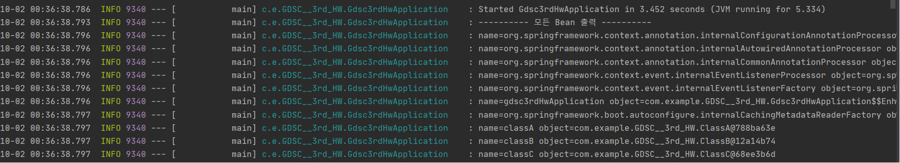
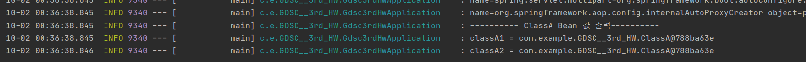

# Spring Bean의 개념과 사용 방법


		의존성

		의존성이란 하나의 객체가 다른 객체 없이 제대로 된 역할을 할 수 
		없다는 것을 의미한다.	예를 들어 A객체가 B객체 없이 동작이 불가
		능한 상황을 "A가 B에 의존적이다"라고 표현한다.

		          	  ⓐ →→→→→→→→→→→→→→→→→→→→→ ⓑ
   				      ⓐ객체에서 ⓑ객체를 직접 생성

		주입

		주입은 말 그대로 외부에서 밀어 넣는 것을 의미한다. 예를 들어 어떤
		객체가 필요로 하는 개체를 외부에서 밀어 넣는 것을 의미한다. 주입을
		받는 입장에서는 어떤 객체인지 신경 쓸 필요가 없고 어떤 객체에 의존
		하든 자신의 역할은 변하지 않는다.

                   	  ⓐ →→→→→→→→→???↔↔↔↔↔↔↔↔↔ ⓑ

    	ⓐ는 ⓑ가 필요하다는 신호를 보내고, ???가 ⓑ객체를 외부에서 
		생성하여 주입하게 된다.


		의존성 주입방식을 사용하기 위해서는 ??? 라는 존재가 필요하게 된다.
		스프링 프레임워크에서는 ApplicationContext가 ??? 라는 존재이며,
		필요한 객체들을 생성하고, 필요한 객체들을 주입해주는 역할을 한다.
		따라서 개발자들은 기존의 프로그래밍과 달리 객체와 객체를 분리해서 
		생성하고, 이러한 객체들을 엮는(Wiring) 작업의 형태로 개발한다.

		예를 들어 Coding 클래스와 Computer 클래스가 존재하며, Coding 클래
		스가 Computer 클래스에 의존적(Coding을 하기위해 Computer 필요)
		이라 가정해보자.

```java
	// Coding class
	public class Coding{
		public Computer computer = new Computer();
	}
```
		위와 같은 경우는 프로그래머가 직접 값을 결정하는 경우이다 Computer
		의 자식 개체로 Cellphone, Laptop, DeskTop이 존재한다 가정해보자. 
		각각의 클래스를 사용하고 싶을 경우 위 코드의 new Computer() 대신
		new CellPhone(), new Laptop(), new DeskTop()을 써야한다. 이런
		상황을 유연성이 떨어진다라고 표현하고, 이러한 문제를 해결하기 위해
		결합성을 느슨하게 해야한다.

```java
	// Coding class
	@Component
	public class Coding{
		public Computer computer;
	}
```
		어떤 자식 클래스를 사용할지 모르는 상황에서 new를 사용하지 않음
		으로서 유연성을 확보한다. 하지만 이 경우의 문제점은 Spring이 클래스
		의 생성 여부를 모른다는 점이다. 이때 Annotation @Component를 사용
		하면 Spring에게 class의 존재를 알려주게 되고 이 때 bean이 생긴다. 
		이때 아직 Computer에 대해 아무것도 주입하지 않았기에 Null이 뜬다.
		즉 Spring에게 주입을 요청해 줘야한다.
```java
	// Coding class
	@Component
	public class Coding{
		@AutoWired
		public Computer computer;
	}
```
		Annotation AutoWired를 통해 Spring이 자동으로 엮어준다. 출력을 해
		보면 computer의 주소값이 출력됨을 확인할 수 있다.
		하지만 필드 위와 같이 필드 주입을 사용하면 여러 문제가 발생한다.
		1. 순환 참조 시 예외가 발생하지 않기에 StackOverFlow 발생
		2. 다른 곳에서 수정이 되기에 문제가 발생할 수 있음
		3. 주입이 되지 않아도 객체는 생성되기에 NPE가 발생할 수 있음
		
		그렇기에 보통 생성자 주입을 사용한다.
```java
	// Coding class
	@Component
	public class Coding{
		public Computer computer;

		@Autowired
		public Coding(Computer computer){
			this.computer = computer;
		}
	}
```
		또한 lombok이라는 라이브러리를 이용하여 Annotation 
		@RequiredArgsConstructor, @AllArgsConstructor,
		@NoArgsConstructor, @Getter 등을 이용하여 더 편하게
		생성자 주입을 할 수도 있다.

```java
	// Coding class
	@Component
	@RequiredArgsConstructor
	public class Coding{
		private final Computer computer;
	}
```


