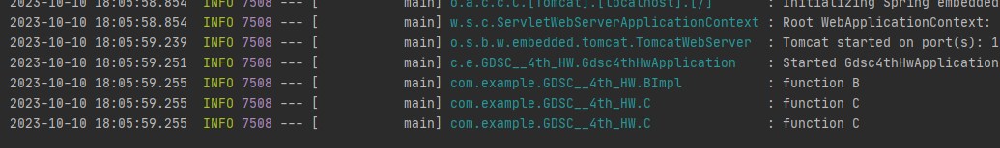

# DI
	1. DI란
		DI란 외부에서 두 객체 간의 관계를 결정해주는 디자인 패턴으로,
		인터페이스를 사이에 둬 클래스 레벨에서의 의존 관계가 고정되지
		않도록 하고 런타임시에 관계를 동적으로 주입하여 유연성을 확보
		하고 결합도를 낮춘다

	2. Autowired
		@Autowired 어노테이션을 사용하면 Spring이 자동적으로 해당 클
		래스의 객체를 찾아서 필요한 의존성을 주입한다

	3. 의존 관계 주입의 종류
		1) 생성자 주입
			* 생성자를 통해 의존 관계 주입
			* 객체 최초 생성 시점에 스프링이 주입
			* 주입받은 객체가 변하지 않거나, 강제하기 위해 사용
			* 생성자가 1개만 있을 경우 생략해도 주입이 가능
			* 생성자가 여러 개일 경우 가장 많은 의존성을 주입 할 수
				있는 생성자를 사용해 의존성을 주입
		
		2) setter 주입
			* setter라 불리는 필드의 값을 변경하는 수정자 메소드를 통해
				의존관계를 주입
			* 선택, 변경이 있는 의존관계에 사용
			* 빈 생성자를 필요로 하기에 파이널 필드를 만들 수 없고,
				의존성의 불변을 보장할 수 없음
			
		3) 필드 주입
			* 필드에 바로 주입하는 방법
			* 필드 주입을 사용하면 여러 문제가 발생한다.
				1. 순환 참조 시 예외가 발생하지 않기에 StackOverFlow 발생
				2. 다른 곳에서 수정이 되기에 문제가 발생할 수 있음
				3. 주입 되지 않아도 객체는 생성되기에 NPE가 발생할 수 있음

		4) 메소드 주입

	3. DI 주의점
		1) NullPointerException
			필드 주입이나 setter 주입의 경우 스프링의 빈 관리 기능을 빌리
			지 않고 new 키워드로 객체를 생성할 경우 NullPointerException
			이 발생할 수 있다.
		2) 순환참조 문제
			필드 주입이나 setter 주입의 경우, A객체와 B객체가 서로 의존하
			는 순환참조가 발생할 수 있다.
		
	4. 주입 대상이 여러 개일 경우
		1) 주입 방법
			주입 대상이 여러개일 경우 먼저 타입으로, 그 다음에는 이름으로 
			기준을 찾는다. 생성자 매개변수명을 수동으로 바꿔주면 주입 대상
			을 변경할 수는 있지만 헷갈리는 경우가 발생한다.
		2) @Qualifier
			@Qualifier 어노테이션 안에 해당 Bean의 구분자를 지정할 수 있음
		3) @Primary
			@Primary 어노테이션을 통해 우선으로 주입되도록 지정할 수 있음
# Spring Boot
	1. Spring Boot란
		Spring Boot는 스프링 기반의 어플리케이션을 빠르게 개발하고 실행하기 
		위한 프레임 워크이다. Spring은 컴포넌트 코드 작성은 가벼웠으나 개발
		구성은 무거웠다는 단점이 존재했고, 이러한 구성 작업은 개발 저항으로
		나타났다. 이러한 개발 저항을 해결하기 위해 Spring Boot가 만들어졌
		다. 개발에 필요한 복잡한 설정을 Spring Boot가 대신 해줌으로써, 개
		발자의 편리한 Spring 사용에 도움을 준다

	2. Spring Boot의 특징
		1) WAS
			Tomact 같은 웹 서버를 내장해 별도의 웹 
			서버를 설치하지 않아도 된다
		2) 라이브러리 관리
			손쉬운 빌드 구성을 위한 스타터 종속성
			제공 및 라이브러리 버전 관리
		3) 자동 구성
			* 프로젝트 시작에 필요한 스프링과 외부
			  라이브러리에 빈을 자동으로 등록
			* 스프링 애플리케이션에 공통으로 필요한
				애플리케이션 기능을 자동으로 구성
		4) 외부 설정
			환경에 따라 달라져야 하는 외부 설정 공통화
		5) 프로덕션 준비
			모니터링을 위한 메트릭과 상태 확인 기능을 제공
			* 스프링 애플리케이션 컨텍스트에 구성된 빈
			* 스프링 부트의 자동 구성으로 구성된 것
			* 애플리케이션에서 사용할 수 있는 환경 변수,
			  시스템 프로퍼티, 구성 프로퍼티, 명령줄 인자
			* 최근에 처리된 HTTP 요청 정보
			* 메모리 사용량, 가비지 컬렉션, 웹 요청,
			  데이터 소스 사용량 등 다양한 메트릭

